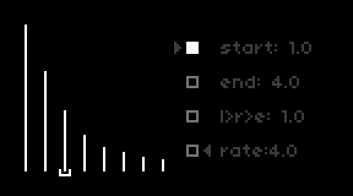
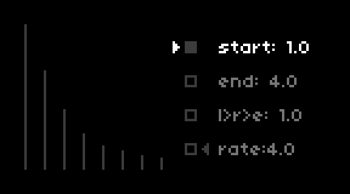
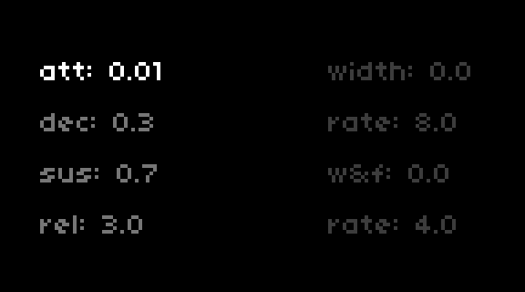
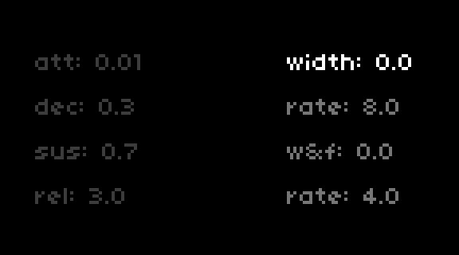

# overtones
*overtones* is a script based on additive synthesis. It’s easy to program and made for atmospheric, evolving digital soundscapes and other types of artificial sounds. There are 8 partials and 4 snapshots. Each snapshot contains a complete waveform, and they are morphed into each other using 3 different methods. The user interface has 5 sections of parameters. Use **k2** and **k3** to step through them.

A midi keyboard is required for this script. A monome grid and/or MIDI controller is optional. MIDI in device and channel can be set in PARAMETERS>EDIT.

Section 1:  
  
  
This is where waveforms are created. Use **e1** to select 1 of 4 snapshots which are represented by the empty boxes in the middle of the screen. The selected snapshot is filled. Use **e2** to move the cursor at the bottom which selects 1 of the 8 partials to edit. Use **e3** to adjust the volume of the selected partial.

**k1** + **k2** will copy the currently selected snapshot. **k1** + **k3** will paste it into another selected snapshot. The memory will be overwritten if another snapshot is copied and deleted if the script has been reloaded.

Tip:  
The snapshot remains in memory even after another PSET has been loaded. This makes it possible to transfer a waveform from one PSET to another.

Section 2:  
  
  
These are the morph parameters. The arrows show the start (left) and end (right) point while the dimly lit boxes represent the snapshots. Use **e2** to select a parameter to edit and **e3** to adjust it. *start* sets the beginning of the morph. *end* sets either the turning point of the morph or the end of it depending on the next parameter. *l>r>e* stands for *(l)fo to (r)andom to (e)nvelope*. The *lfo* morphs from the start to the end point and then back again in reversed order continuously, *random* morphs randomly within the set range and the *envelope* morphs from the start to the end point where it stays for as long as a note is sustained. *rate* sets the speed of the morph. Use **e1** to adjust the main volume (a pop-up screen will show the value).

Tip 1:  
Setting the start and end point in the opposite direction will reverse the morph.

Tip 2:  
Setting the start and end parameters to the same point will freeze the morph. This is useful for drones.

Section 3:  
  
  
The ADSR envelope controls the overall volume. Use **e2** to select a parameter and **e3** to adjust it. Use **e1** to adjust the main volume.

Section 4:  
  
  
*width* spreads out the partials in the stereo field. They are constantly panned randomly, and *rate* sets the speed. *w&f* adds random pitch fluctuations and sets the modulation depth. *rate* sets the speed. Use **e2** to select a parameter and **e3** to adjust it. Use e1 to adjust the main volume.

Section 5:  
  
  
This section shows all 4 snapshots on the same screen. All tools that are available in section 1 are here as well, including the possibility to copy and paste snapshots. The first number in the top right corner shows the selected snapshot, the second the partial and the third below the others the volume. The circle marks the selected partial.